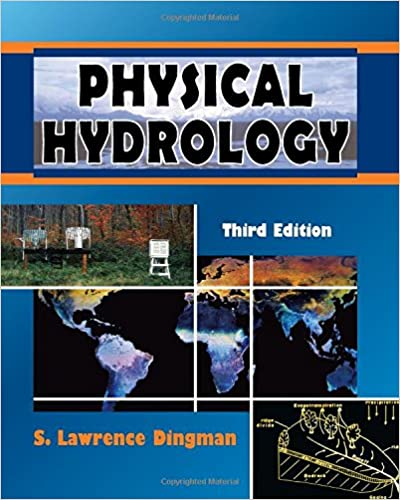
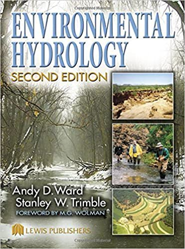
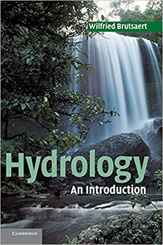

## Files

Quick access to source files of all units and assignments.  
Right-click and choose "Save as" to download files.

- **[1 - Introduction](/teaching/hydrology/#1---introduction-to-the-course)**:
[lecture](https://github.com/yairmau/website/blob/master/_posts/2020-02-01-introduction-lecture.ipynb);
[exercises](https://github.com/yairmau/website/blob/master/_notebooks/2020-02-01-python-intro.ipynb);
[data1](https://raw.githubusercontent.com/yairmau/website/master/archive/hydrology/data-sep2020-feb2021.csv),
[data2](https://raw.githubusercontent.com/yairmau/website/master/archive/hydrology/1year.csv)  
- **[2.1 - Variability of Precipitation](/teaching/hydrology/#21-variability-of-precipitation)**:
[lecture (Interannual)](https://github.com/yairmau/website/blob/master/_notebooks/2020-02-02-interannual-variability-of-precipitation-lecture.ipynb),
[lecture2 (Intra-annual)](https://github.com/yairmau/website/blob/master/_notebooks/2020-02-02-intra-annual-variability-of-precipitation-seasonality-lecture.ipynb);
[exercises](https://github.com/yairmau/website/blob/master/_notebooks/2020-02-02-variability-of-precipitation-exercises.ipynb);
[code1 (Interannual)](https://github.com/yairmau/website/blob/master/_notebooks/2020-02-02-interannual-variability-of-precipitation-code.ipynb),
[code2 (Intra-annual)](https://github.com/yairmau/website/blob/master/_notebooks/2020-02-02-intra-annual-variability-of-precipitation-code.ipynb)  
- **[2.2 - Return Period](/teaching/hydrology/#22-return-period)**:
[lecture](https://github.com/yairmau/website/blob/master/_notebooks/2020-02-02-return-period-lecture.ipynb);
[exercises](https://github.com/yairmau/website/blob/master/_notebooks/2020-02-02-return-period-exercises.ipynb);
[code](https://github.com/yairmau/website/blob/master/_notebooks/2020-02-02-return-period-code.ipynb)  
- **[Assignment 1](/teaching/hydrology/#assignment-1)**  
- **[3 - ET](/teaching/hydrology/#3---evapotranspiration)**:  [lecture](https://github.com/yairmau/website/blob/master/_notebooks/2020-02-03-evapotranspiration-lecture.ipynb);
[exercises](https://github.com/yairmau/website/blob/master/_notebooks/2020-02-03-evapotranspiration-exercises.ipynb);  
- **[Assignment 2](/teaching/hydrology/#assignment-2)**  
- **[4 - Infiltration](/teaching/hydrology/#4---infiltration)**:
[lecture](https://github.com/yairmau/website/blob/master/_notebooks/2020-02-04-infiltration-lecture.ipynb);
[exercises](https://github.com/yairmau/website/blob/master/_notebooks/2020-02-04-infiltration-exercises.ipynb);  
- **[5.1 - Streamflow](/teaching/hydrology/#5---streamflow):**
[lecture](https://github.com/yairmau/website/blob/master/_notebooks/2020-02-05-streamflow-lecture.ipynb);
[exercises](https://github.com/yairmau/website/blob/master/_notebooks/2020-02-05-streamflow-exercises.ipynb);  
- **[5.2 - Streamflow](/teaching/hydrology/#5---streamflow):**
[lecture](https://github.com/yairmau/website/blob/master/_notebooks/2020-02-05-unit-hydrograph-lecture.ipynb)  
- **[Assignment 3](/teaching/hydrology/#assignment-3)**  
- **[6 - Budyko](/teaching/hydrology/#6---budykos-framework):**
[lecture](https://github.com/yairmau/website/blob/master/_notebooks/2020-02-06-budyko-framework-lecture.ipynb)
- **[7 - Spatial ](/teaching/hydrology/#7---spatial-variability):**
[lecture](https://github.com/yairmau/website/blob/master/_notebooks/2020-02-07-spatial-distribution.ipynb)  
- **[Final Assignment](/teaching/hydrology/#final-assignment):**
[assignment](https://github.com/yairmau/website/blob/master/_notebooks/2020-02-01-assignment-FINAL.ipynb)
- **[Images and gifs](/teaching/hydrology/gifs)**

 

## Sources

### Books

Dingman, S.L., 2015. [Physical Hydrology: Third Edition](https://books.google.co.il/books?id=rUUaBgAAQBAJ). Waveland Press.

Ward, A.D., Trimble, S.W., 2003. [Environmental Hydrology, Second Edition](https://books.google.co.il/books?id=yANwmTjf588C). CRC Press.

Brutsaert, W., 2005. [Hydrology: An Introduction](https://books.google.co.il/books?id=3PMWGrsaXqwC). Cambridge University Press.

I would like to share the Afterword of Brutsaert's book, the excellent "[A short historical sketch of theories about the water circulation on Earth](../../archive/hydrology/brutsaert-history-of-hydrology.pdf)". It's definitely worth reading!!

 

A Jupyter Notebook will open whenever you click on a <button class="my_button_small" onclick="window.open('.', '_blank');">button like this</button>. You can then see its source code and download it by clicking on "View on GitHub".

## 1 - Introduction to the course

**A very wide overview**  
<button class="my_button_small" onclick="window.open('https://yairmau.github.io/website/markdown/2020/02/01/introduction-lecture.html', '_blank');">Lecture</button>
What is Hydrology? What are the main processes in the hydrologic cycle? An overview, based on the excellent [USGS Water Science School](https://www.usgs.gov/special-topic/water-science-school/science/water-cycle-adults-and-advanced-students). 

**Python intro**  
<button class="my_button_small" onclick="window.open('https://yairmau.github.io/website/jupyter/2020/02/01/python-intro.html', '_blank');">Exercises</button>
Let's have fun plotting some data. If you need, download the necessary data for this exercise [here](https://raw.githubusercontent.com/yairmau/website/master/archive/hydrology/data-sep2020-feb2021.csv) and [here](https://raw.githubusercontent.com/yairmau/website/master/archive/hydrology/1year.csv). 

 

## 2 - Precipitation

**Data**  
<button class="my_button_small" onclick="window.open('.', '_blank');">Data</button>
If necessary, download the following data to be used in the Jupyter Notebooks below:
Bilbao ([daily](https://github.com/yairmau/website/tree/master/archive/hydrology/BILBAO_daily.csv), and [monthly](https://github.com/yairmau/website/tree/master/archive/hydrology/BILBAO_monthly.csv)), 
Eilat ([daily](https://github.com/yairmau/website/tree/master/archive/hydrology/Eilat_daily.csv), and [monthly](https://github.com/yairmau/website/tree/master/archive/hydrology/Eilat_monthly.csv)), 
Tel Aviv ([daily](https://github.com/yairmau/website/tree/master/archive/hydrology/TEL_AVIV_READING_daily.csv), and [monthly](https://github.com/yairmau/website/tree/master/archive/hydrology/TEL_AVIV_READING_monthly.csv)), 
Beer Sheva ([daily](https://github.com/yairmau/website/tree/master/archive/hydrology/BEER_SHEVA_daily.csv), and [monthly](https://github.com/yairmau/website/tree/master/archive/hydrology/BEER_SHEVA_monthly.csv)), 
Ben-Gurion airport ([daily](https://github.com/yairmau/website/tree/master/archive/hydrology/BEN_GURION_daily.csv), and [monthly](https://github.com/yairmau/website/tree/master/archive/hydrology/BEN_GURION_monthly.csv)), 
London ([daily](https://github.com/yairmau/website/tree/master/archive/hydrology/LONDON_HEATHROW_daily.csv), and [monthly](https://github.com/yairmau/website/tree/master/archive/hydrology/LONDON_HEATHROW_monthly.csv)).   

### 2.1 Variability of Precipitation

**Interannual variability of precipitation**  
<button class="my_button_small" onclick="window.open('https://yairmau.github.io/website/jupyter/2020/02/02/interannual-variability-of-precipitation-lecture.html', '_blank');">Lecture</button>
Quantifying interannual variability of precipitation.   

**Intra-annual variability of precipitation**  
<button class="my_button_small" onclick="window.open('https://yairmau.github.io/website/markdown/2020/02/02/intra-annual-variability-of-precipitation-seasonality-lecture.html', '_blank');">Lecture</button>
A comparison between the seasonality of Tel Aviv and London

**Practice calculating inter- and intra-annual variability**  
<button class="my_button_small" onclick="window.open('https://yairmau.github.io/website/jupyter/2020/02/02/variability-of-precipitation-exercises.html', '_blank');">Exercises</button>
Now it's your turn to calculate and plot graphs.

**Code of the lectures above**  
<button class="my_button_small" onclick="window.open('https://yairmau.github.io/website/jupyter/hydrology/2020/02/02/interannual-variability-of-precipitation-code.html', '_blank');">Code</button>
Interannual variability of precipitation;
<button class="my_button_small" onclick="window.open('https://yairmau.github.io/website/jupyter/2020/02/02/intra-annual-variability-of-precipitation-code.html', '_blank');">Code</button>
Intra-annual variability of precipitation

### 2.2 Return Period

<!-- **Return period**   -->
<button class="my_button_small" onclick="window.open('https://yairmau.github.io/website/jupyter/2020/02/02/return-period-lecture.html', '_blank');">Lecture</button>
Was Bilbao's 1983 "freak" flood such an unexpected event? How often should we expect very large downpours?  

**Practice calculating return periods**  
<button class="my_button_small" onclick="window.open('https://yairmau.github.io/website/jupyter/2020/02/02/return-period-exercises.html', '_blank');">Exercises</button>
Now it's your turn to calculate and plot graphs.  

**Code of return period**  
<button class="my_button_small" onclick="window.open('https://yairmau.github.io/website/jupyter/2020/02/02/return-period-code.html', '_blank');">Code</button>
Extremely dirty code, it's really for my own reference :)

 

## Assignment 1
<button class="my_button_small" onclick="window.open('https://yairmau.github.io/website/markdown/2020/02/01/assignment1.html', '_blank');">Assignment</button>
First assignment  

 

## 3 - Evapotranspiration

**Data**  
<button class="my_button_small" onclick="window.open('.', '_blank');">Data</button>
If necessary, download the following data to be used in the Jupyter Notebooks below: 
Bet dagan ([3h-data](https://yairmau.com/archive/hydrology/bet-dagan-3h.csv), [evaporation pan](https://yairmau.com/archive/hydrology/bet-dagan-day-pan.csv), [radiation](https://yairmau.com/archive/hydrology/bet-dagan-radiation.csv)), 
[Headers for sub hourly data](https://yairmau.com/archive/hydrology/HEADERS_sub_hourly.txt), 
. 

**Evapotranspiration - definitions and models**  
<button class="my_button_small" onclick="window.open('https://yairmau.github.io/website/markdown/2020/02/03/evapotranspiration-lecture.html', '_blank');">Lecture</button>

**Evapotranspiration - Thornthwaite and Penman equations**  
<button class="my_button_small" onclick="window.open('https://yairmau.github.io/website/jupyter/2020/02/03/evapotranspiration-exercises.html', '_blank');">Exercises</button>

 

## Assignment 2

<button class="my_button_small" onclick="window.open('https://yairmau.github.io/website/markdown/2020/02/01/assignment2.html', '_blank');">Assignment</button>
Second assignment  

 

## 4 - Infiltration

**Data**  
<button class="my_button_small" onclick="window.open('.', '_blank');">Data</button>
Nassif and Wilson (1975), "The influence of slope and rain intensity on runoff and infiltration", [download here](https://yairmau.com/archive/hydrology/nassif-1975-THE-INFLUENCE-OF-SLOPE-AND-RAIN-INTENSITY-ON-RUNOFF-AND-INFILTRATION.pdf), figure 8 (2nd panel) from this paper [download here](https://yairmau.com/archive/hydrology/nassif-16percent-slope.png), 4 csv files of infiltration rate against time, [download here](https://yairmau.com/archive/hydrology/infiltration-rate.zip).

**Infiltration**  
<button class="my_button_small" onclick="window.open('https://yairmau.github.io/website/markdown/2020/02/04/infiltration-lecture.html', '_blank');">Lecture</button>
Definitions, factors that influence infiltration, Horton equation, Green & Ampt equation, the least squares method.

**Infiltration**  
<button class="my_button_small" onclick="window.open('https://yairmau.github.io/website/jupyter/2020/02/04/infiltration-exercises.html', '_blank');">Exercises</button> Let's practice!

 

## 5 - Streamflow

### 5.1 Streamflow

<button class="my_button_small" onclick="window.open('https://yairmau.github.io/website/markdown/2020/02/05/streamflow-lecture.html', '_blank');">Lecture</button>

**Streamflow exercises**  
<button class="my_button_small" onclick="window.open('https://yairmau.github.io/website/jupyter/2020/02/05/streamflow-exercises.html', '_blank');">Exercises</button>

**Streamflow code**  
<button class="my_button_small" onclick="window.open('https://yairmau.github.io/website/jupyter/2020/02/05/streamflow-code.html', '_blank');">Code</button>

### 5.2 Unit Hydrograph

<button class="my_button_small" onclick="window.open('https://yairmau.github.io/website/markdown/2020/02/05/unit-hydrograph-lecture.html', '_blank');">Lecture</button>

 

## Assignment 3

<button class="my_button_small" onclick="window.open('https://yairmau.github.io/website/markdown/2020/02/01/assignment3.html', '_blank');">Assignment</button>
Third assignment  

 

## 6 - Budyko's framework

**Budyko's framework**  
<button class="my_button_small" onclick="window.open('https://yairmau.github.io/website/markdown/2020/02/06/budyko-framework-lecture.html', '_blank');">Lecture</button>

**Budyko code**  
<button class="my_button_small" onclick="window.open('https://yairmau.github.io/website/jupyter/2020/02/06/budyko-framework-code.html', '_blank');">Code</button>

 

## 7 - Spatial variability

**Spatial distribution**  
<button class="my_button_small" onclick="window.open('https://yairmau.github.io/website/markdown/2020/02/07/spatial-distribution-lecture.html', '_blank');">Lecture</button>

 

## Final Assignment

<button class="my_button_small" onclick="window.open('https://yairmau.github.io/website/markdown/2020/02/01/assignment_final.html', '_blank');">Assignment</button>