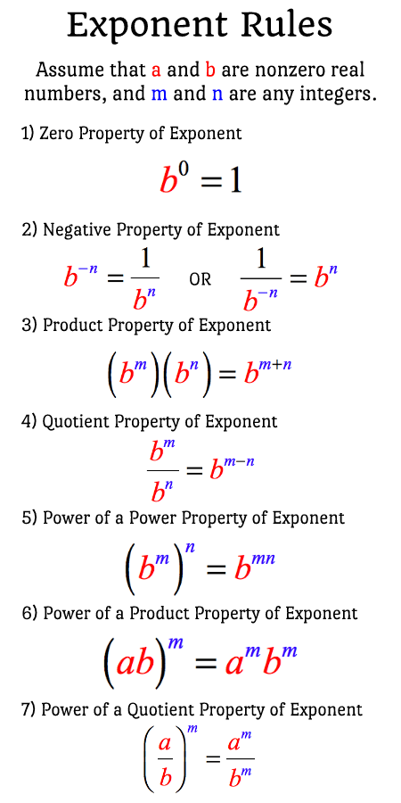

## basic units and prefixes

Units for three SI base quantities

| Quantity | Unit Name | Unit Symbol |
|---|---|---|
| Length [L] | meter | m |
| Time [T] | second | s |
| Mass [M] | kilogram | kg |

Some prefixes for SI Units that you **must** remember!

| Factor | Prefix | Symbol |
|---|---|---|
| $10^9$ | giga- | G |
| $10^6$ | mega- | M |
| $10^3$ | kilo- | k |
| $10^{-2}$ | centi- | c |
| $10^{-3}$ | milli- | m |
| $10^{-6}$ | micro- | $\mu$ |
| $10^{-9}$ | nano- | n |

## exponent rules

{: style="width:500px;"}

## volume and surface area

{: style="width:500px;"}

## 1 horse-sized duck or 100 duck-sized horses?

{: style="width:500px;"}
